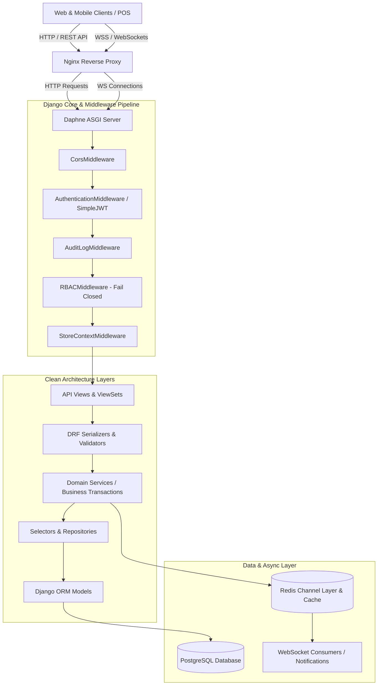

# AutoCRM — Enterprise Multi-Branch Inventory & Automotive Management System

[](https://www.python.org/)
[](https://www.djangoproject.com/)
[](https://www.django-rest-framework.org/)
[](https://channels.readthedocs.io/)
[](https://www.postgresql.org/)
[]()
[](LICENSE)

---

## 📌 Table of Contents
- [Overview](#-overview)
- [System Architecture & Design Patterns](#-system-architecture--design-patterns)
- [Key Features & Modules](#-key-features--modules)
  - [1. Multi-Store & Branch Isolation](#1-multi-store--branch-isolation)
  - [2. Granular Role-Based Access Control (RBAC)](#2-granular-role-based-access-control-rbac)
  - [3. Security & Comprehensive Audit Logging](#3-security--comprehensive-audit-logging)
  - [4. Product Catalog & Fractional Quantity Engine](#4-product-catalog--fractional-quantity-engine)
  - [5. Purchase Management & Supplier Ledger](#5-purchase-management--supplier-ledger)
  - [6. Point of Sale (POS) & Payment Split Engine](#6-point-of-sale-pos--payment-split-engine)
  - [7. Stock Transfers & Real-Time WebSockets](#7-stock-transfers--real-time-websockets)
  - [8. Stock Auditing & Discrepancy Resolution](#8-stock-auditing--discrepancy-resolution)
  - [9. Write-Offs & Adjustments](#9-write-offs--adjustments)
  - [10. Customer Debts & FIFO Settlements](#10-customer-debts--fifo-settlements)
  - [11. Business Analytics & Dynamic Report Builder](#11-business-analytics--dynamic-report-builder)
  - [12. Internationalization (i18n)](#12-internationalization-i18n)
- [Technology Stack](#-technology-stack)
- [Project Directory Structure](#-project-directory-structure)
- [API Endpoints Overview](#-api-endpoints-overview)
- [Installation & Local Setup](#-installation--local-setup)
- [Environment Configuration](#-environment-configuration)
- [Management Commands & Background Tasks](#-management-commands--background-tasks)
- [Running Automated Tests](#-running-automated-tests)
- [Production Deployment Guide](#-production-deployment-guide)
- [License](#-license)

---

## 🌟 Overview

**AutoCRM** is an enterprise-grade ERP, CRM, and Inventory Management backend tailored for automotive spare parts distributors, wholesale networks, and multi-branch retail stores. Built on **Django 5.2**, **Django REST Framework (DRF)**, and **Django Channels**, it provides high-concurrency transaction processing, multi-branch data isolation, precision fractional stock calculations, granular RBAC permissions, and real-time WebSocket communication.

### High-Level Architectural Highlights:
* **Clean Layered Architecture:** Strict separation between HTTP Views, Serializers, Domain Services, Selectors, Repositories, and Core Models.
* **Fail-Closed Granular RBAC:** A 3-tier authorization model (`Module -> Feature -> Action`) enforced at both the middleware and view levels.
* **Multi-Branch Isolation:** Automatic store scoping ensuring branch operators only interact with data pertaining to their assigned location.
* **Audit Trail:** Automatic logging of all mutations, logins, and permission checks with scheduled log retention policies.
* **Resilient Financial Transactions:** Atomic balance updates, multi-channel split payments, refund tracking, and FIFO debt settlement.
* **Real-time Event Streaming:** Asynchronous notifications via Redis channel layer and Daphne ASGI server for stock alerts and transfer approvals.

---

## 🏗 System Architecture & Design Patterns



---

## 🚀 Key Features & Modules

### 1. Multi-Store & Branch Isolation
* **Store Classification:** Supports central warehouses (`BASE`) and retail branches (`STORE`).
* **Branch Scoping:** Store users are linked via `StoreUser` roles (`Manager`, `Seller`). Non-superusers automatically have queries scoped to their assigned branches via `StoreContextMiddleware` and `StoreScopePermission`.
* **Cross-Store Protection:** Foreign key references across different stores are strictly validated within service layers.

### 2. Granular Role-Based Access Control (RBAC)
* **3-Tier Hierarchy:** Permissions are categorized hierarchically: `Module -> Feature / Submodule -> Action` (e.g. `products.catalog.edit`, `reports.sales.export`).
* **Fail-Closed Security:** Users without assigned roles or specific action codes are blocked immediately with `403 Forbidden`.
* **Dynamic Permission Catalog:** The entire system permission tree is exposed dynamically via `/api/users/roles/catalog/` for frontend configuration.
* **Per-Report Granularity:** Every single report features separate permissions for viewing (`.view`) and exporting (`.export`).

### 3. Security & Comprehensive Audit Logging
* **Authentication:** Dual authentication support — **HTTP-only secure Cookies** and **Authorization Bearer Headers** via `djangorestframework-simplejwt`. Includes automatic refresh token rotation and token blacklisting.
* **Full-Spectrum Audit Log:** `AuditLogMiddleware` intercepts mutating requests (POST, PUT, PATCH, DELETE) and records the acting user, target store, IP address, user-agent, status code, and payload changes. Placed prior to RBAC to log unauthorized attempts.
* **Data Retention Lifecycle:** Automated log pruning via management commands (`AUDIT_LOG_RETENTION_DAYS = 60`).

### 4. Product Catalog & Fractional Quantity Engine
* **Hierarchical Master Data:** Multi-level categories, brands, storage locations (`ProductLocation`), and measurement units.
* **Automated Barcode & SKU Generation:**
  * Category-based SKU generation (e.g., `PRD-000123`).
  * Automatic EAN-13 checksum calculation and SVG/PNG barcode rendering (`python-barcode` + `Pillow`).
* **Quarter / Pair Fractional Units:** Built-in `ProductUnitMeasurement` supporting `WHOLE` (Dona / Piece, step `1.00`) and `QUARTER` (Juft / Pair, step `0.25`, `0.50`, `0.75`).
* **Batch Tracking (`ProductBatch`):** Per-store pricing and stock tracking with purchase, wholesale, and retail price tiers.
* **Product History Journal:** Complete timeline auditing field changes (price, name, min_stock, barcode) via `ProductFieldHistory`.

### 5. Purchase Management & Supplier Ledger
* **Progressive Purchase Sessions (`PurchaseSession`):** Multi-step wizard allowing draft creation, item entry, auto-saving, and split payment definition before final confirmation.
* **Stock Intake (`StockEntry`):** Atomic stock incrementation upon confirmation with supplier debt calculation.
* **Supplier Returns (`StockEntryReturn`):** Return items to suppliers with automatic debt deduction or pending refund records without altering historical entry rows.
* **Supplier Financial Ledger (`SupplierTransaction`):** Complete transaction history (`in` for debt increase, `pay` for settlements, `ret` for returned goods).
* **Excel Import & Analysis:** Bulk supplier invoice import with pre-validation and matching algorithms.

### 6. Point of Sale (POS) & Payment Split Engine
* **Split Multi-Payment Processing:** Flexible payment breakdown across multiple channels:
  * **Cash**
  * **Bank Cards** (Custom defined cards: Humo, Uzcard, Visa, Bank Transfer)
  * **Debt** (Direct customer debit)
  * **Mixed** (Custom ratios of Cash + Card + Debt)
* **Bank Card Scoping (`BankCard`):** Cards can be scoped to `sale` (POS), `purchase` (Supplier payments), or `both`. Enforces single default card at DB level.
* **Centralized Payment Recalculation:** Pure domain function `compute_payment_type()` recalculates payment state consistently across sales, debt pay-offs, returns, and migrations.
* **Sale Returns & Refunds:** Allows partial or full returns, adjusting batch stock levels and tracking refunds (`Payment.is_refund = True`).
* **Soft Deletes & Purge Policy:** Sales are archived with `deleted_at` timestamps and can be restored by superusers or purged after 30 days.

### 7. Stock Transfers & Real-Time WebSockets
* **Inter-Store Stock Movement (`StockTransfer`):** Multi-state workflow (`Pending -> Approved / Rejected`).
* **Draft Sessions (`TransferSession`):** Safe multi-item draft creation without locking stock.
* **Atomic Batch Transfers:** Source batch decrement and destination batch increment executed atomically upon approval.
* **Real-time Notifications:** Automated WebSocket event push for transfer creation, approvals, rejections, and low-stock replenishment warnings.

### 8. Stock Auditing & Discrepancy Resolution
* **Inventory Sessions (`InventorySession`):** Branch-level stocktaking without halting store operations.
* **Point-in-time Snapshot:** Freezes expected stock levels at session initialization.
* **Live Movement Tracking (`InventoryMovement`):** Replays sales, transfers, and receipts occurring during an active count session to compute true variances.
* **Automated Finalization:** Generates variance reports (surplus / deficit) and applies corrective `InventoryAdjustment` entries.

### 9. Write-Offs & Adjustments
* **Direct Stock Adjustments (`StockAdjustment`):** Rapid stock updates for import, write-off, or manual recounting with full audit history and cancellation support.
* **Spisaniye / Write-Off Workflow (`WriteOff`):** Dedicated accounting for damaged, expired, lost, or catalog-dropped goods with cost-basis loss calculations.
* **Low Stock Monitoring (`LowStockItem`):** Continuous monitoring against product-level `min_stock` thresholds with replenishment actions (`purchase` from supplier for Base, `transfer` from Base for retail branches).

### 10. Customer Debts & FIFO Settlements
* **Debtor Directory:** Real-time customer balance and debt aging tracking.
* **FIFO Debt Settlement (`CustomerPayDebtAPIView`):** Applies incoming customer payments chronologically across outstanding unpaid sales transactions.
* **Grouped Payment Transactions:** Multi-method debt payments linked via UUID `payment_group` identifiers.

### 11. Business Analytics & Dynamic Report Builder
* **Dynamic Report Engine (`ReportBuilder`):** Flexible querying and aggregation engine supporting custom filters, date ranges, and field groupings.
* **High-Performance Excel Exports:** Streaming workbook generation utilizing `xlsxwriter` and `openpyxl`.
* **Pre-Built Analytical Modules:**
  1. *Sales Performance & Cash Flow*
  2. *Top Selling Products & Profit Margins*
  3. *Product Turnover & Movement Timeline*
  4. *Low Stock & Replenishment Reorder Points*
  5. *Customer Balance & Debt Aging*
  6. *Supplier Sales & Purchasing Volume*
  7. *Warehouse Leftovers & Valuation*
  8. *Payment Journal (Cash vs Card vs Card-specific breakdown)*
  9. *Store Expenses & Losses*

### 12. Internationalization (i18n)
* Dual language support for product names, categories, and attributes:
  * **Uzbek Latin (`uz`)** — Default
  * **Uzbek Cyrillic (`uz-cyrl`)**
* Powered by `django-modeltranslation` and `django-parler`.

---

## 🛠 Technology Stack

| Component | Technology | Description |
|---|---|---|
| **Core Framework** | Django 5.2 (Python 3.12+) | High-level Python web framework |
| **API Layer** | Django REST Framework (DRF) 3.17 | RESTful API toolkit and serializers |
| **Authentication** | SimpleJWT 5.5 | JWT with token rotation and blacklisting |
| **Async & WebSockets** | Channels 4.3 + Daphne 4.2 | Asynchronous ASGI server & WebSocket routing |
| **Message Broker / Cache** | Redis 7.4 + channels-redis | In-memory pub/sub broker for Channels |
| **Database** | PostgreSQL 16+ / SQLite | Relational database with full index optimization |
| **API Documentation** | drf-spectacular 0.29 | OpenAPI 3.0 specification & Swagger UI |
| **Barcode Processing** | python-barcode + Pillow | EAN-13 barcode generation & image synthesis |
| **Excel Processing** | xlsxwriter + openpyxl | High-speed spreadsheet generation and parsing |
| **Internationalization** | django-modeltranslation | Multi-language database field translation |
| **Admin Panel** | django-jazzmin | Modern, responsive Django administration UI |

---

## 📂 Project Directory Structure

```text
auto-crm/
├── apps/
│   ├── common/                  # Shared base models, mixins, pagination, utilities
│   │   ├── legacy/              # Legacy data import & mapping resolvers
│   │   ├── models/              # TimestampMixin, SoftDelete models
│   │   ├── excel_export.py      # Standardized Excel streaming helper
│   │   ├── exception_handler.py # Unified REST exception handler
│   │   ├── permissions.py       # Base permission classes
│   │   ├── quantity.py          # Decimal quantity conversion & step validators
│   │   └── store_scope.py       # Multi-branch query scoping utilities
│   ├── contract/                # Purchasing, Suppliers, Stock Entries & Returns
│   │   ├── models.py            # Supplier, StockEntry, StockEntryReturn, PurchaseSession
│   │   ├── services/            # StockEntryService, SupplierReturnService
│   │   └── views/               # Purchase wizard & entry endpoints
│   ├── debts/                   # Customer debts and FIFO repayment engine
│   │   ├── models.py            # CustomerDebt
│   │   └── services/            # Debt payment allocation services
│   ├── inventory/               # Audits (inventarizatsiya), stock counts & low stock
│   │   ├── models.py            # InventorySession, Snapshot, Count, Adjustment, LowStockItem
│   │   └── services/            # InventoryAuditService, StockAdjustmentService
│   ├── products/                # Product catalog, categories, brands, batches & history
│   │   ├── models.py            # Product, ProductBatch, Category, Brand, ProductFieldHistory
│   │   ├── services/            # ProductService, ProductHistoryService, BarcodeService
│   │   └── utils/               # EAN-13 generator & image paths
│   ├── reports/                 # Analytics dashboard & dynamic report builder
│   │   ├── services/            # ReportBuilderService, FinancialAnalyticsService
│   │   └── views/               # Dynamic report builder & Excel export views
│   ├── sales/                   # Point of Sale, receipts, bank cards & soft delete
│   │   ├── models.py            # Sale, SaleItem, Payment, BankCard
│   │   ├── payment_rules.py     # Pure domain rules for payment type classification
│   │   └── services/            # SaleService, PaymentService, SaleReturnService
│   ├── store/                   # Branch stores and store-user role mapping
│   │   └── models.py            # Store, StoreUser
│   ├── transfer/                # Inter-store transfers, draft sessions & notifications
│   │   ├── models.py            # StockTransfer, TransferSession, Notification
│   │   └── consumers.py         # Real-time WebSocket consumers
│   ├── users/                   # Users, Auth, RBAC permissions & Audit logs
│   │   ├── models/              # User, Role, Customer, AuditLog
│   │   ├── permissions.py       # RBAC catalog & evaluation matrix
│   │   └── services/            # AuthService, RoleService, AuditService
│   └── writeoff/                # Product write-offs (spisaniye)
│       └── models.py            # WriteOff, WriteOffItem
├── core/
│   ├── middleware/              # Custom middleware (RBAC, AuditLog, StoreContext, Logger)
│   ├── settings/
│   │   ├── base.py              # Common project settings
│   │   ├── dev.py               # Development environment configuration
│   │   ├── prod.py              # Hardened production settings
│   │   └── config/              # Granular configs (JWT, Apps, Swagger, DRF)
│   ├── websocket/               # ASGI authentication & cookie JWT parser
│   ├── asgi.py                  # ASGI configuration with ProtocolTypeRouter
│   ├── wsgi.py                  # WSGI configuration
│   └── urls.py                  # Root URL routing & API docs
├── docs/                        # Specifications, reports & migration guides
├── manage.py                    # Django management script
├── requirements.txt             # Project dependencies
└── README.md                    # Project documentation
```

---

## 🔌 API Endpoints Overview

The API is structured under the `/api/` prefix. Interactive API documentation is available via Swagger UI.

### 1. Authentication & User Management (`/api/users/`)
| Method | Endpoint | Description |
|---|---|---|
| `POST` | `/api/users/login/` | Authenticate user; returns tokens & sets HTTP-only cookies |
| `POST` | `/api/users/logout/` | Invalidate refresh token and clear cookies |
| `POST` | `/api/users/auth/refresh/` | Refresh expired access token |
| `GET` | `/api/users/profile/` | Retrieve current authenticated user profile |
| `GET` | `/api/users/roles/catalog/` | Fetch full hierarchical RBAC permission tree |
| `GET/POST`| `/api/users/roles/` | List and create RBAC roles |
| `GET` | `/api/users/audit-logs/` | Query system audit logs with filters |
| `GET/POST`| `/api/users/customers/list/` | Customer directory and debt balances |

### 2. Products & Inventory Batches (`/api/products/`)
| Method | Endpoint | Description |
|---|---|---|
| `GET/POST`| `/api/products/` | Product catalog listing and creation |
| `GET/PUT` | `/api/products/<id>/` | Product detail and update |
| `GET` | `/api/products/<id>/history/` | Comprehensive product event history journal |
| `POST` | `/api/products/products/import/` | Bulk Excel product import |
| `GET/POST`| `/api/products/categories/` | Category management |
| `GET/POST`| `/api/products/brand/` | Brand management |
| `GET` | `/api/products/item/list/` | Per-store batch stock & price listings |

### 3. Purchasing & Supplier Operations (`/api/contract/`)
| Method | Endpoint | Description |
|---|---|---|
| `GET/POST`| `/api/contract/supplier/` | Supplier management |
| `GET` | `/api/contract/supplier/<id>/stats/` | Supplier purchase volume & debt metrics |
| `GET/POST`| `/api/contract/entry/session/` | Purchase session wizard (draft auto-save) |
| `POST` | `/api/contract/entry/session/<id>/confirm/` | Confirm session -> execute stock intake |
| `GET/POST`| `/api/contract/entry/list/` | Confirmed stock entries listing |
| `POST` | `/api/contract/entry/<id>/return/` | Create supplier product return |
| `POST` | `/api/contract/supplier-payments/create/` | Settle supplier debt |

### 4. Sales & POS (`/api/sales/`)
| Method | Endpoint | Description |
|---|---|---|
| `POST` | `/api/sales/create/` | Process POS sale with multi-channel payment split |
| `GET` | `/api/sales/list/` | Filterable sales history |
| `GET` | `/api/sales/statistics/` | Aggregated sales metrics (cash, card, debt, margins) |
| `POST` | `/api/sales/sale-return/` | Process customer item return and refund |
| `GET/POST`| `/api/sales/bank-cards/` | Manage payment bank cards and scopes |
| `POST` | `/api/sales/bulk-delete/` | Soft-delete sales to archive (Superuser only) |
| `POST` | `/api/sales/archive/restore/` | Restore archived sales (Superuser only) |

### 5. Inter-Store Transfers (`/api/transfer/`)
| Method | Endpoint | Description |
|---|---|---|
| `GET/POST`| `/api/transfer/` | List and create stock transfers |
| `GET/POST`| `/api/transfer/session/` | Transfer draft session management |
| `POST` | `/api/transfer/<id>/approve/` | Approve transfer and atomically move stock |
| `POST` | `/api/transfer/<id>/reject/` | Reject pending transfer |
| `GET` | `/api/transfer/notifications/` | In-app user notifications |

### 6. Stock Auditing & Adjustments (`/api/inventory/`)
| Method | Endpoint | Description |
|---|---|---|
| `POST` | `/api/inventory/start/` | Begin inventory session & capture snapshot |
| `POST` | `/api/inventory/scan/` | Record scanned product quantity |
| `POST` | `/api/inventory/finalize/` | Compute variances and apply balance corrections |
| `POST` | `/api/inventory/adjust/` | Single-product direct stock adjustment |
| `GET` | `/api/inventory/low-stock/` | Real-time low stock replenishment alerts |

### 7. Write-Offs (`/api/writeoff/`)
| Method | Endpoint | Description |
|---|---|---|
| `GET/POST`| `/api/writeoff/list/` | Query and create product write-off acts |
| `GET` | `/api/writeoff/<id>/` | Write-off act detail with item cost breakdowns |

### 8. Customer Debt Management (`/api/debts/`)
| Method | Endpoint | Description |
|---|---|---|
| `POST` | `/api/debts/customer/pay/` | Settle customer debt with FIFO allocation |
| `GET` | `/api/debts/customer/<id>/payments/` | Payment and credit history for customer |

### 9. Analytics & Dynamic Reports (`/api/reports/`)
| Method | Endpoint | Description |
|---|---|---|
| `GET` | `/api/reports/dashboard/` | Executive dashboard KPI summary |
| `GET` | `/api/reports/top-products/` | Top performing products ranking |
| `GET` | `/api/reports/builder/meta/` | Report builder field metadata & dimensions |
| `POST` | `/api/reports/builder/` | Generate customized analytical table |
| `POST` | `/api/reports/builder/export/` | Export custom analytical table to Excel |
| `GET` | `/api/reports/export/` | Complete analytical multi-sheet workbook export |

### 10. Interactive API Documentation
* **Swagger UI:** `/api/schema/swagger-ui/`
* **Redoc:** `/api/schema/redoc/`
* **OpenAPI Schema:** `/api/schema/`

---

## ⚙ Installation & Local Setup

### Prerequisites
* **Python 3.12+**
* **PostgreSQL 14+** (or SQLite for local lightweight testing)
* **Redis 6+** (for Channels and WebSocket layer)
* **Git**

### Step-by-Step Installation

1. **Clone the Repository:**
   ```bash
   git clone https://github.com/AbdimajidovDev/auto-crm.git
   cd auto-crm
   ```

2. **Set Up Python Virtual Environment:**
   ```bash
   python3.12 -m venv .venv
   source .venv/bin/activate
   ```

3. **Install Dependencies:**
   ```bash
   pip install --upgrade pip
   pip install -r requirements.txt
   ```

4. **Configure Environment Variables:**
   Create a `.env` file in the project root:
   ```env
   ENVIRONMENT=dev
   SECRET_KEY=your-secure-development-secret-key
   DEBUG=True
   ALLOWED_HOSTS=localhost,127.0.0.1
   CORS_ALLOWED_ORIGINS=http://localhost:5173,http://127.0.0.1:5173

   # Database (leave empty to use default SQLite in dev, or configure PostgreSQL)
   DB_NAME=autocrm_db
   DB_USER=autocrm_user
   DB_PASSWORD=autocrm_password
   DB_HOST=localhost
   DB_PORT=5432

   # Redis / Channels
   REDIS_HOST=127.0.0.1
   REDIS_PORT=6379
   ```

5. **Apply Database Migrations:**
   ```bash
   python manage.py migrate
   ```

6. **Create an Administrator Account:**
   ```bash
   python manage.py createsuperuser
   ```

7. **Run the Development Server:**
   * **Standard HTTP (WSGI):**
     ```bash
     python manage.py runserver 8000
     ```
   * **ASGI with WebSockets (Daphne):**
     ```bash
     daphne -b 127.0.0.1 -p 8000 core.asgi:application
     ```

---

## 🔧 Management Commands & Background Tasks

AutoCRM includes several purpose-built management commands:

| Command | Usage | Description |
|---|---|---|
| `prune_audit_logs` | `python manage.py prune_audit_logs` | Cleans up audit logs older than `AUDIT_LOG_RETENTION_DAYS` (60 days) |
| `purge_deleted_sales` | `python manage.py purge_deleted_sales` | Permanently removes archived sales older than 30 days |
| `generate_missing_barcodes` | `python manage.py generate_missing_barcodes` | Backfills missing EAN-13 barcodes and barcode images for products |
| `fill_purchase_price` | `python manage.py fill_purchase_price` | Backfills historical purchase prices into sales items for margin auditing |
| `import_legacy` | `python manage.py import_legacy` | Imports and transforms legacy ERP spreadsheet dumps |
| `dedupe_stores` | `python manage.py dedupe_stores` | Merges duplicate branch entries and reassigns foreign keys |

---

## 🧪 Running Automated Tests

AutoCRM includes a comprehensive test suite with 100+ automated test cases covering authentication, RBAC authorization, payment splitting, inventory transactions, and debt settlements.

Run tests using Django's test runner:
```bash
python manage.py test --no-input
```

To run tests for a specific application:
```bash
python manage.py test apps.sales
python manage.py test apps.products
python manage.py test apps.users
python manage.py test apps.inventory
python manage.py test apps.reports
```

---

## 🚢 Production Deployment Guide

### Recommended Production Architecture
* **OS:** Ubuntu 22.04 / 24.04 LTS
* **Database:** PostgreSQL 16+ with connection pooling
* **Process Manager:** `systemd` managing Daphne ASGI workers
* **Reverse Proxy:** Nginx with SSL/TLS termination and WebSocket upgrade support
* **Cache & Broker:** Redis 7+

### 1. Production Environment File (`.env`)
```env
ENVIRONMENT=prod
SECRET_KEY=generate-a-strong-random-50-character-secret
DEBUG=False
ALLOWED_HOSTS=api.yourdomain.com
CORS_ALLOWED_ORIGINS=https://yourdomain.com,https://www.yourdomain.com
FRONTEND_URL=https://yourdomain.com

DB_NAME=autocrm_production
DB_USER=autocrm_db_user
DB_PASSWORD=strong_db_password
DB_HOST=127.0.0.1
DB_PORT=5432

REDIS_HOST=127.0.0.1
REDIS_PORT=6379

EMAIL_HOST=smtp.mailgun.org
EMAIL_PORT=587
EMAIL_USE_TLS=True
EMAIL_HOST_USER=postmaster@yourdomain.com
EMAIL_HOST_PASSWORD=smtp_password
DEFAULT_FROM_EMAIL="AutoCRM <noreply@yourdomain.com>"
```

### 2. Systemd Service Configuration (`/etc/systemd/system/autocrm.service`)
```ini
[Unit]
Description=AutoCRM Daphne ASGI Service
After=network.target postgresql.service redis.service

[Service]
User=www-data
Group=www-data
WorkingDirectory=/var/www/auto-crm
ExecStart=/var/www/auto-crm/.venv/bin/daphne -b 127.0.0.1 -p 8000 core.asgi:application
Restart=always
RestartSec=5
EnvironmentFile=/var/www/auto-crm/.env

[Install]
WantedBy=multi-user.target
```

### 3. Nginx Reverse Proxy Configuration (`/etc/nginx/sites-available/autocrm`)
```nginx
server {
    server_name api.yourdomain.com;

    client_max_body_size 50M;

    location /static/ {
        alias /var/www/auto-crm/assets/staticfiles/;
        expires 30d;
        add_header Cache-Control "public, max-age=2592000";
    }

    location /media/ {
        alias /var/www/auto-crm/assets/media/;
        expires 30d;
    }

    # HTTP API proxy
    location / {
        proxy_pass http://127.0.0.1:8000;
        proxy_set_header Host $host;
        proxy_set_header X-Real-IP $remote_addr;
        proxy_set_header X-Forwarded-For $proxy_add_x_forwarded_for;
        proxy_set_header X-Forwarded-Proto $scheme;
    }

    # WebSocket proxy
    location /ws/ {
        proxy_pass http://127.0.0.1:8000;
        proxy_http_version 1.1;
        proxy_set_header Upgrade $http_upgrade;
        proxy_set_header Connection "upgrade";
        proxy_set_header Host $host;
        proxy_set_header X-Real-IP $remote_addr;
        proxy_set_header X-Forwarded-For $proxy_add_x_forwarded_for;
        proxy_set_header X-Forwarded-Proto $scheme;
    }
}
```

---

## 📄 License

This project is licensed under the **MIT License** — see the [LICENSE](LICENSE) file for details.

### Core Development Team
- **To'lqinbek Abdimajidov** — Lead System Architect & Backend Engineer ([AbdimajidovDev](https://github.com/AbdimajidovDev))
